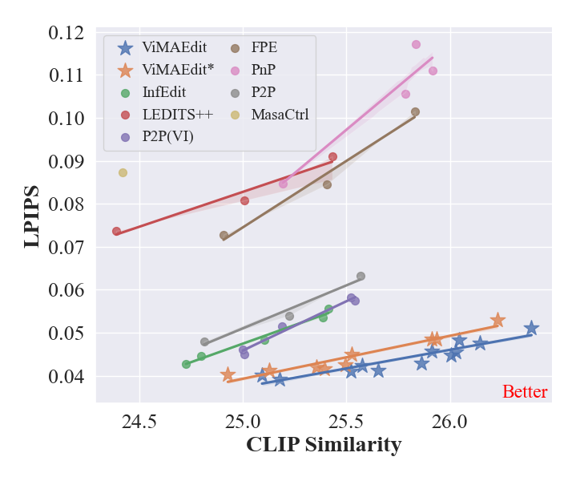

# ViMAEdit: vision-guided and mask-enhanced adaptive editing algorithm for prompt-based image editing

## Performance on PIE-Bench
| Method | Structure Distance | PSNR | LPIPS | MSE | SSIM | CLIP-Whole | CLIP-Edited |
|-------|-------|-------|-------|-------|-------|-------|-------|
| P2P-Zero | 51.13 | 21.23 | 143.87 | 135.00 | 77.23 | 23.36 | 21.03 |
| MasaCtrl | 24.47 | 22.78 | 87.38 | 79.91 | 81.36 | 24.42 | 21.38 |
| PnP | 24.29 | 22.64 | 106.06 | 80.45 | 79.68 | 25.41 | 22.62 |
| P2P | **11.64** | 27.19 | 54.44 | 33.15 | 84.71 | 25.03 | 22.13 |
| InfEdit | 13.78 | 28.51 | 47.58 | 32.09 | 85.66 | 25.03 | 22.22 |
| TurboEdit | - | 29.52 | 44.74 | 26.08 | 91.59 | 25.05 | 22.34 |
| ViMAEdit | 12.82 | 28.59 | **44.53** | 29.96 | 86.40 | 25.88 | 22.81 |
| ViMAEdit-XL | 12.06 | **29.65** | 48.75 | **24.50** | **92.30** | **25.98** | **22.89** |


## Citation
If you make use of our work, please cite our paper:
```
@article{wang2024vision,
  title={Vision-guided and Mask-enhanced Adaptive Denoising for Prompt-based Image Editing},
  author={Wang, Kejie and Song, Xuemeng and Liu, Meng and Yuan, Jin and Guan, Weili},
  journal={arXiv preprint arXiv:2410.10496},
  year={2024}
}
```
